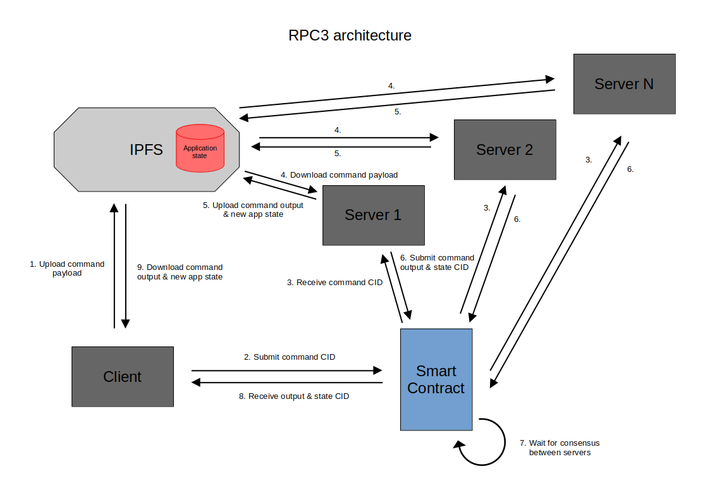

# RPC3

A _Proof-of-Concept_ for decentralized remote procedure calls, leveraging IPFS and privacy-enabled blockchain.

## Inspiration

This project aims at providing an alternate solution to the classic and widely used client-server architecture when it
comes to consuming remote services. This architecture works well when the service in question is managed by a central
organization, because it is straightforward, cheap and simple to understand:

But if we want a service that is entirely autonomous and decentralized, we need to imagine a new architecture where the
client doesn't interact with a server, but with a network of computers that work together and reach consensus about the
results.

First thing that comes to mind when hearing this definition is blockchain technology. Indeed, blockchain provides a
great part of the solution, especially smart contracts which allowed the surge of decentralized exchanges and other
DApps. But this comes with a certain number of known limitations :

- **Computational resources of smart contracts are limited**, whether it is CPU power, memory or disk storage. EVM
  chains for example use a gas system as a way to monetize these resources, and capacity depends on the maximum size of
  blocks which is very limited
- **Programming of smart contracts can only be done with a limited set of instructions.** Because result needs to be
  deterministic, we cannot use regular server-side programming languages, frameworks and libraries. We need to rely on
  oracles and inter-chain communication protocols to get data from external world, which adds layers of complexity.
- **Deploying updates is a tough task** as smart contracts are by design not upgradeable. Design patterns exist in order
  to mitigate this limitation, like the proxy pattern, but some cases may require more complex migration logic that
  inherently induces various risks.

When I discovered [Oasis Protocol](https://oasisprotocol.org) and how they managed to add privacy on smart contracts, I
immediately realized that it would unlock new use cases and solve problems that did not have a solution until now.
Regarding the three points above, there are indeed some projects out there that aim at solving one or many of them, but
they often imply the creation of a new protocol or a new blockchain from scratch. However, here I was able to glimpse
the possibility of a solution that only uses smart contracts on an already existing protocol, by leveraging its privacy
capabilities.

This is how the RPC3 project is born. I gave it this name because the type of client-server interactions that I wanted
to cover matches pretty well the definition of [Remote Procedure
Calls](https://en.wikipedia.org/wiki/Remote_procedure_call), and the "3" is a reference to
[web3](https://fr.wikipedia.org/wiki/Web3) as the solution relies on web3 technologies.

## Overview

We obviously cannot expect such a new architecture to be as simple and straightforward as the classic one, simply
because of the number of technical challenges being inherently higher. Some balance must be found between complexity and
feasibility, the initial brainstorming is certainly what took the most time; especially when you are working solo on it.
Here is what I finally came up with:

Let's break this down:

- The general concept is that instead of one central server, we have **many servers** operated by **independant**
  individuals or organizations. All of these servers run the **same application code**, written **with the usual
  programming languages**, frameworks and libraries. The smart contract acts as a **coordinator** between all of these
  servers, while data storage and transmission is done via **IPFS** (request and response payloads + application state)
- When the client wants to send a command, it **uploads** the payload (opcode, parameters, etc) of the command to IPFS,
  then **submits** the CID (IPFS hash-based content identifier) to the smart contract
- Servers are notified of incoming commands from the contract, they will download the content from IPFS and **execute
  the command on their local environment**
- Each server write the **command output** and the **new application state** to IPFS, and **submit** both resulting CIDs
  back to the contract
- The contract determines whether a **consensus has been reached** by comparing results between servers
- The client is notified that a **response is available**, from there they can get the CID and download the content from
  IPFS

## Remarks

- The consensus step is the very thing that is not achievable with a blockchain without privacy capabilities. Indeed,
  the results submitted must be kept private in order to have participants compute the results themselves instead of
  just blindly reposting the results that are currently winning the consensus. Although it doesn't prevent cases where
  many servers cooperate and "share" results between each other (also known as Sybil attacks), this can be mitigated for
  example by requiring servers to stake tokens in the contract to be able to participate. The use of a privacy-enabled
  blockchain also makes it possible to have end-to-end encryption so user data remains encrypted in both
  request/response payloads and application state.
- Sending commands is only useful if the client needs to perform an operation that modifies application state. For
  read-only queries, the client is expected to download the application state from IPFS and query the data themselves.
  This is a similar problem that we have with blockchains, where the client needs to download the whole blockchain by
  self-running a node in order to query data without relying on a third party. So just like blockchains, it would be
  totally possible to have intermediates that act as a gateway for clients to query data in a more convenient way.
- Since servers run code that is written in usual languages, they are technically allowed to call external web2 services
  through HTTP-based APIs for example. This gives developers the **full responsibility** not to create side-effects or
  rely on potentially non-deterministic sources. On the other hand, this has the huge benefit of removing the need for
  oracles. After all, this architecture is pretty similar to how some oracle protocols work.
- Upgrading the code of servers is possible without redeploying the coordinator smart contract. The process would be
  similar to blockchain node upgrades, where a committee agrees on a block number that represents the deadline before
  which servers need to deploy the new code. If the application state needs a migration, launching the migration script
  would be a regular access-controlled command sent through the system just like any other command.

## Scope and project contents

This repository contains:

- A smart contract written in Solidity for the Sapphire EVM paratime that has the following features:
  - Register and unregister servers with a Dutch auction-styled staking mechanism that offers protection against Sybil
    attacks
  - Accept requests from clients and organize them in batches to improve scalability and keep down gas costs
  - A basic consensus algorithm to compare results between servers, with customizable quorum and ratio thresholds
  - Housekeeping mechanism to filter out inactive servers from the consensus process
  - Basic reward mechanism to incentivize servers to contribute positively, without explicitly defining the source of
    income that fund these rewards
- A rudimentary demo app that allows clients to increment a private counter:
  - A command-line client app that connects to a local IPFS node and can interact with the contract. The users chooses a
    number and will increment a counter by that number, that initially starts at 0
  - A server app that connects to the same local IPFS node and includes scripts to launch many servers and simulate the
    consensus process
  - The off-chain state of the application (in this case, the counter values for each user) is a SQLite database file
    living on IPFS. Clients may download it to retrieve the value of their counter, and servers use it to update its
    contents
- A "private computation unit" (PCU) smart contract that adds an encryption layer to the whole system. This contract is
  entirely decoupled from the system itself, which is why I didn't mention it when I explained the general concept. It
  basically makes it possible for clients to send encrypted requests and for servers to perform computations over
  private data, before sending the encrypted response back to the client while keeping the application state encrypted
  as well. The counter demo app leverages that in order to keep the counters private to the users owning them (one user
  cannot see the value of another user's counter, and servers have no knowledge of the values being computed).

## Limitations and disclaimers

- Although I made the effort to properly unit-test all of my smart contracts, the code of the demo applications is
  essentially untested and is prone to bugs.
- The system has not been tested at a large scale. There probably are limitations that can only be observed in
  real-world conditions that I may have missed. For example, when I played around with IPFS, I noticed that newly
  uploaded data may take some time to propagate from one node to another. I'm not sure how problematic that could be in
  the context of this project, and I didn't have the opportunity to evaluate the impact yet.
- Currently you need to manually send funds to the contract in order to reward servers for their contribution. This is
  good because it allows to define the app's business model in a decoupled way, but this part is not covered in the demo
  counter app.
- The consensus process takes a certain time to complete. Between the submission of the command and the availability of
  the output, there is an observed minimum of 40 seconds of delay. This makes it non suitable for applications requiring
  live data or frequent updates. The scope is limited to _fast read, slow write_ type of applications.

## Challenges

Working on this project was of course extremely challenging for me. While I do have a solid programming background in
Node.js and that I've been working as a software engineer for 2 years, it was my first time coding in Solidity. I made
progression in this project in a learning-by-doing fashion; but Solidity being a very simple language with familiar
syntax, learning the language itself wasn't an issue for me. Most of the work was about mastering the different kind of
data location (storage, memory, calldata), and how the different instructions affect the gas costs and how to optimize
them.

An essential aspect that I've got to learn was security of smart contracts. I documented myself about reentrancy
attacks, how to implement reentrancy guards and pull payments using openzeppelin solutions, and how to implement EIP712
permits in order to authenticate view calls. I even managed to design a EIP712 implementation that is 100% gasless by
leveraging Sapphire encryption!

The last challenge was to think about all of the edge cases inherent to the complexity of the system I designed. How to
code a proper staking mechanism, how to code a proper consensus algorithm, how to handle cases where servers go
inactive, what to do when clients submit invalid data... But in the end, I had fun and I'm happy with the result :)

## What's next ?

My dream would be to become the creator of an application that would entirely be run by its users, just like what
Satoshi managed to achieve with Bitcoin. It is not a coincidence that Mirayashi sounds like Satoshi...

With this project I hope to lay the foundation for decentralized applications with real-world use cases that go way
beyond the exchange of digital assets. By "real-world use cases", I mean social platforms, calendars, cloud services,
messaging apps, word and image processing, or even games. If you look at the dApps that perform well as of today, they
are for most of them centered on the exchange of financial value (DEX, lending, NFT marketplaces...). But the reason why
we still barely have any popular dApp that cover the most everyday use cases, like the ones I just enumerated, I'm
convinced that the various limitations and the difficult integration with the web2 world that I exposed earlier in this
document play a significant role. And I'm proud to present this _Proof-of-Concept_ to show the world that an alternative
might actually be possible.

The next steps for me would be to acquire constructive feedback in order to determine which aspects can be improved
design-wise. I would then work on refining the implementation by writing modules and libraries to help other developers
design their first RPC3-based app. And maybe, who knows, I will make my own one as well, that one app that could
potentially allow me to achieve my dream.

## Installation guide

You can find the full installation guide [here](./INSTALL.md).
